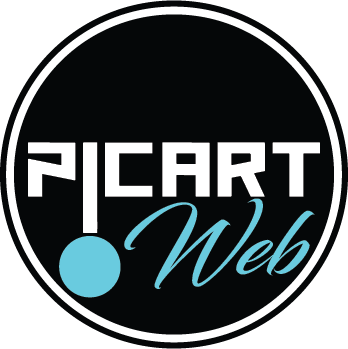

<div align="center">
  <a href="https://picartweb.com/projects">
    
  </a>

  # Helvetia Construction

  ### Premium Swiss Construction Website

  <p>
    A high-end multilingual static website demo for a Swiss construction and renovation company, built for the Picart Web portfolio.
  </p>

  <p>
    <a href="https://picartweb.com/bau/"><strong>Live Demo</strong></a>
    ·
    <a href="https://picartweb.com/projects">Picart Web Portfolio</a>
    ·
    <a href="mailto:info@picartweb.com">Contact</a>
  </p>

  <p>
    
    
    
    
    
    
  </p>
</div>

---

## Overview

Helvetia Construction is a premium static website concept for a Swiss construction and renovation company. It presents a polished, trustworthy, image-led brand experience with clean typography, refined motion, multilingual content, and responsive layouts for desktop and mobile.

The project is designed as a portfolio-ready demo for showcasing modern construction websites built with plain HTML, CSS, and JavaScript.

## Features

- Premium Swiss construction and renovation visual style
- Bright white, beige, bronze, and deep navy color system
- Multilingual content with DE, EN, and IT language switching
- Language preference stored with `localStorage`
- Responsive mobile-first layout
- Animated homepage hero with construction-focused visual details
- Scroll reveal animations
- Services page with premium service sections and selector UI
- Projects page with filters, modal details, and before/after showcase
- Contact form frontend success state
- Google Maps iframe on contact page
- Cookie consent banner
- WhatsApp floating contact button
- Impressum, Datenschutz, and custom 404 pages
- Clean URL `.htaccess` deployment for `/bau/`
- Picart Web footer credit

## Pages

- Home: `/bau/`
- Leistungen: `/bau/leistungen`
- Projekte: `/bau/projekte`
- Uber uns: `/bau/ueber-uns`
- Kontakt: `/bau/kontakt`
- Impressum: `/bau/impressum`
- Datenschutz: `/bau/datenschutz`
- 404: `/bau/404.html`

## Tech Stack

- HTML5
- CSS3
- Vanilla JavaScript
- Apache `.htaccess` for production clean URLs
- No backend
- No build tools
- No frontend framework

## Folder Structure

```text
.
├── assets/
│   ├── css/
│   │   └── style.css
│   ├── images/
│   └── js/
│       └── script.js
├── github/
│   └── ASSETS.md
├── 404.html
├── about.html
├── contact.html
├── datenschutz.html
├── impressum.html
├── index.html
├── projects.html
├── services.html
├── .htaccess
├── DEPLOYMENT.md
├── LICENSE
└── README.md
```

## Deployment Notes

The site is configured for deployment at:

```text
https://picartweb.com/bau/
```

The included `.htaccess` supports:

- HTTPS redirect
- Clean URLs under `/bau/`
- Redirects from old `.html` URLs
- Custom 404 page
- Asset caching
- Gzip/deflate compression
- Security headers

See [DEPLOYMENT.md](DEPLOYMENT.md) for the upload path, route map, and post-deployment checklist.

## Screenshots

Preview assets can be added in the `github/` folder:

| Preview | Purpose |
| --- | --- |
| `preview.png` | Main repository preview |
| `preview.gif` | Motion or interaction preview |
| `hero.png` | Homepage hero screenshot |
| `services.png` | Leistungen page screenshot |
| `projects.png` | Projekte page screenshot |
| `mobile.png` | Mobile layout screenshot |

Screenshot files are intentionally not required for the site to run.

## Showcase Projects

| Project | Status | Link |
| --- | --- | --- |
| Helvetia Construction | Live portfolio demo | [GitHub](https://github.com/PicartWeb/helvetia-construction) |
| Picart Web Portfolio | Portfolio hub | [picartweb.com/projects](https://picartweb.com/projects) |
| Cleaning Company Website | Future showcase | Coming soon |
| Hotel Website | Future showcase | Coming soon |
| Travel Agency Website | Future showcase | Coming soon |
| Restaurant Website | Future showcase | Coming soon |
| Picart OS | Future product | Coming soon |
| Lynx | Future product | Coming soon |

## Hire Me

Picart Web builds premium websites, brand experiences, and portfolio-ready digital products.

- Website: [https://picartweb.com](https://picartweb.com/)
- Portfolio: [https://picartweb.com/projects](https://picartweb.com/projects)
- Email: [info@picartweb.com](mailto:info@picartweb.com)
- GitHub: [https://github.com/PicartWeb](https://github.com/PicartWeb)

## License

This project uses the custom **Picart Web Portfolio License**.

You may view, learn from, and fork this project for personal learning. Commercial use, client work, reselling, rebranding, removing credits, redistributing as a template, or using this project in paid products is not permitted.

Copyright © 2026 Picart Web  
[https://picartweb.com](https://picartweb.com/)
